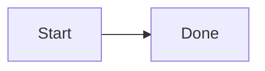
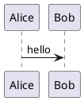

# markdown-serve

**A local live Markdown viewer for the folder you’re working in.**

Point it at a notes tree, a docs repo, or any project with `.md` files. You get a file sidebar, instant preview, and automatic reload when you save — no cloud, no CDN, no plantuml.com.

<p align="center">
  
</p>

<p align="center"><em>Light and dark theme in one glance — same layout, same diagrams.</em></p>

## What you get

| | |
|---|---|
| **Browse the tree** | Sidebar lists Markdown, images, and PDFs under the serve root. Fuzzy find with `/`, or prefix with `'` for exact match. |
| **Live preview** | Edits on disk refresh the browser over a WebSocket. Save and the page updates. |
| **Real rendering** | Tables, syntax-highlighted code (Pygments), images, linked assets, PDF iframe preview. |
| **Diagrams** | `mermaid` and `plantuml` / `puml` fences render in place — Mermaid in the browser, PlantUML via local Java. |
| **Themes** | Light/dark toggle (persisted). Right-click the theme button to pick a Pygments style per theme. |
| **Offline-first** | UI, Mermaid, and PlantUML jar ship with the project. Works on a plane. |

Wide tables and PlantUML SVGs expand the content panel instead of getting squashed.

## Quick start

Requires [uv](https://docs.astral.sh/uv/) and a JRE (`java` on `PATH`) for PlantUML.

```bash
git clone <this-repo>
cd markdown-serve
uv sync
export PATH="$PWD/bin:$PATH"
```

From any directory that has Markdown:

```bash
markdown-serve
```

Opens `http://127.0.0.1:8765` and serves the current working directory.

| Flag | Description |
|------|-------------|
| `-p`, `--port` | Port (default `8765`) |
| `--host` | Bind address (default `127.0.0.1`) |
| `-r`, `--root` | Directory to serve (default: CWD) |
| `--no-open` | Don’t open a browser |

## Diagrams

Fenced blocks just work:

````markdown



````

Mermaid uses the vendored browser script. PlantUML runs locally (`java -jar` on the bundled LGPL jar, or a `plantuml` binary on `PATH`).

## Configuration

On first run, `src/markdown_serve/config.json` is created with defaults if it is missing.
It holds theme, Pygments styles, and font stacks:

```json
{
  "theme": "light",
  "styles": { "light": "default", "dark": "nord" },
  "fonts": {
    "sans": ["Avenir Next", "Segoe UI", "system-ui", "sans-serif"],
    "mono": ["Fira Code", "ui-monospace", "monospace"]
  }
}
```

Theme and style choices from the UI are written back here. Fonts are config-only (no picker).
The file is gitignored so local preferences stay on your machine.

## Third-party / offline assets

Vendored under `src/markdown_serve/assets/vendor/`:

- **Mermaid** (MIT) — `mermaid.min.js`
- **PlantUML** (LGPL jar, unmodified) — `plantuml.jar`

markdown-serve uses PlantUML, which is distributed under the LGPL. Details: `src/markdown_serve/assets/vendor/README.md`.
