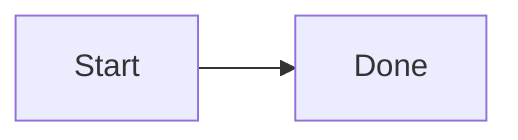
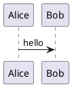

# markdown-serve

Live-preview all markdown files in the current working directory, with hot reload and static asset serving for linked files (images, PDFs, etc.).

Runs fully offline: UI assets, Mermaid, and PlantUML are local (no CDN / plantuml.com).

Theme, Pygments styles, and fonts live in `src/markdown_serve/config.json`
(`fonts.sans` / `fonts.mono` font stacks; no UI picker for fonts).

## Third-party / offline assets

Vendored under `src/markdown_serve/assets/vendor/`:

- **Mermaid** (MIT) — `mermaid.min.js`
- **PlantUML** (LGPL jar, unmodified) — `plantuml.jar`

markdown-serve uses PlantUML, which is distributed under the LGPL. See `assets/vendor/README.md`.

## Setup

```bash
uv sync
```

PlantUML diagrams need a JRE (`java` on `PATH`). A PlantUML jar is vendored under `src/markdown_serve/assets/vendor/`. Alternatively install a `plantuml` binary.

Add the project `bin/` directory to your `PATH`:

```bash
export PATH="/path/to/markdown-serve/bin:$PATH"
```

## Usage

From any directory that contains markdown:

```bash
markdown-serve
```

Options:

| Flag | Description |
|------|-------------|
| `-p`, `--port` | Port (default `8765`) |
| `--host` | Bind address (default `127.0.0.1`) |
| `-r`, `--root` | Directory to serve (default: CWD) |
| `--no-open` | Don't open a browser |

The server watches the tree for changes and refreshes the browser automatically.

## Diagrams

````markdown



````

Mermaid renders in the browser from a vendored script. PlantUML is rendered locally via Java.
