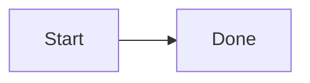
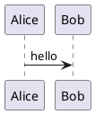

# markdown-serve

Live-preview all markdown files in the current working directory, with hot reload and static asset serving for linked files (images, PDFs, etc.).

## Setup

```bash
uv sync
```

Add the project `bin/` directory to your `PATH`:

```bash
export PATH="/path/to/markdown-serve/bin:$PATH"
```

## Usage

From any directory that contains markdown:

```bash
markdown-serve
```

Options:

| Flag | Description |
|------|-------------|
| `-p`, `--port` | Port (default `8765`) |
| `--host` | Bind address (default `127.0.0.1`) |
| `-r`, `--root` | Directory to serve (default: CWD) |
| `--no-open` | Don't open a browser |

The server watches the tree for changes and refreshes the browser automatically.

## Diagrams

Fenced blocks are rendered in the browser:

````markdown



````

Mermaid runs locally via Mermaid.js. PlantUML is encoded and rendered through [plantuml.com](https://www.plantuml.com) (diagram source is sent to that service).
