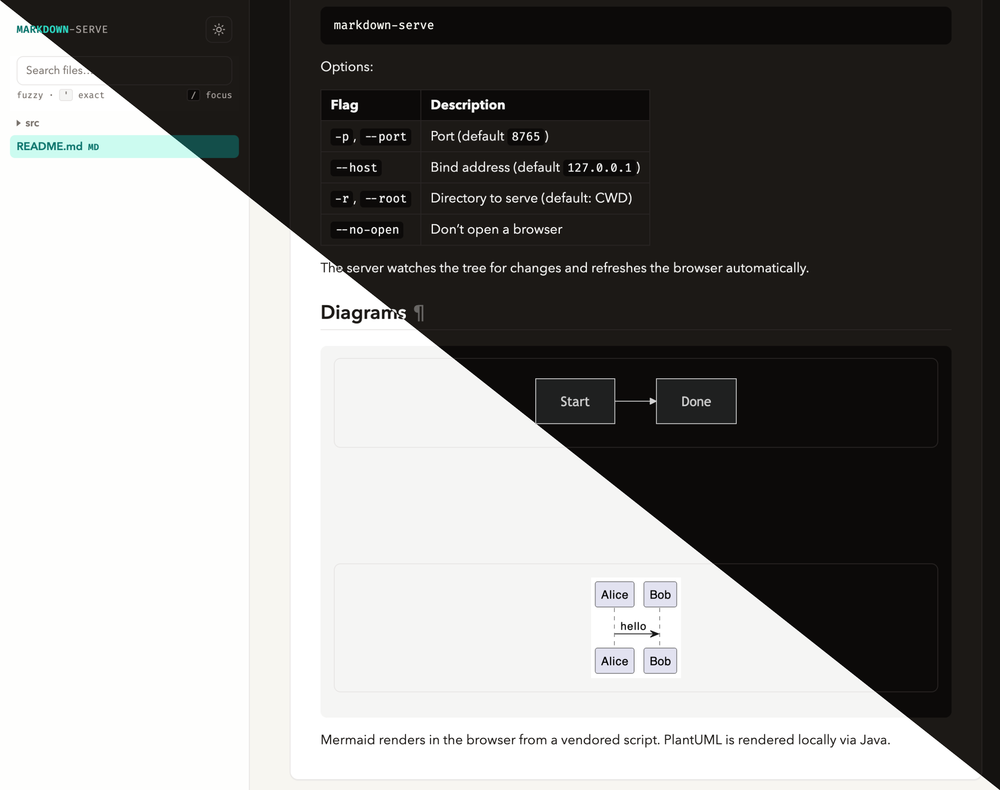
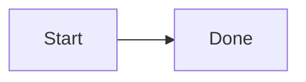
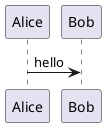

# markdown-serve

**A local live Markdown viewer for the folder you’re working in.**

Point it at a notes tree, a docs repo, or any project with `.md` files. You get a file sidebar, instant preview, and automatic reload when you save — no cloud, no CDN, no plantuml.com.

<p align="center">
  
</p>

<p align="center"><em>Light and dark theme in one glance — same layout, same diagrams.</em></p>

## What you get

| | |
|---|---|
| **Browse the tree** | Collapsible left sidebar lists Markdown, diagram files, images, and PDFs. Fuzzy find with `/`, or prefix with `'` for exact match. |
| **Content search** | Switch to **Content** mode to full-text search all Markdown and diagram files (same fuzzy / `'exact` rules). Hits link to `?line=N` and scroll to that line. |
| **Table of contents** | Collapsible right sidebar lists headings on the open page (nested by level), with scroll spy. |
| **Broken links** | Local links to missing files show in orange with a ⚠ marker. |
| **Live preview** | Edits on disk refresh the browser over a WebSocket. Save and the page updates. |
| **Real rendering** | Nested lists (2-space indent), tables, syntax-highlighted code ([Pygments](https://pygments.org/)), images, linked assets, PDF iframe preview. |
| **Diagrams** | [`mermaid`](https://mermaid.js.org/) and [`plantuml`](https://plantuml.com/) / `puml` fences render in place — Mermaid in the browser, PlantUML via local Java. Standalone `.mmd` / `.puml` files open directly as a rendered diagram. |
| **Themes** | Light/dark toggle (persisted). **Right-click the theme button** to show a Pygments style picker for the current theme (code highlighting). |
| **Offline-first** | UI, Mermaid, and PlantUML jar ship with the project. Works on a plane. |

Wide tables and PlantUML SVGs expand the content panel instead of getting squashed.

## Quick start

Requires [uv](https://docs.astral.sh/uv/) and a JRE (`java` on `PATH`) for PlantUML.

```bash
git clone <this-repo>
cd markdown-serve
uv sync
export PATH="$PWD/bin:$PATH"
```

From any directory that has Markdown:

```bash
markdown-serve
```

Opens `http://127.0.0.1:8765` and serves the current working directory.

| Flag | Description |
|------|-------------|
| `-p`, `--port` | Port (default `8765`) |
| `--host` | Bind address (default `127.0.0.1`) |
| `-r`, `--root` | Directory to serve (default: CWD) |
| `--no-open` | Don’t open a browser |

## UI and search

### Sidebars

- **Files (left)** — Collapse with the chevron next to the theme toggle; a floating button restores it. Collapse state is stored in `config.json`.
- **On this page (right)** — Nested heading list for the current Markdown file. Collapse with its chevron; expands again from the floating control on the right. Collapse state is stored in `config.json`. Hidden when there are no headings, or when viewing an image/PDF.

### File and content search

Focus the finder with `/`. Use the **Files** / **Content** tabs (or `Tab` while the finder is focused) to switch modes.

| Mode | Behavior |
|------|----------|
| **Files** | Filters the sidebar tree by path/name. Default is fuzzy subsequence match; prefix the query with `'` for substring (exact) match. |
| **Content** | Server-side full-text search over all Markdown under the serve root. Same fuzzy / `'exact` syntax. Results show a snippet and line badge (`L42`); opening one navigates to `/path/to/file.md?line=42` and scrolls/highlights that line in the preview. |

Hints under the finder: `fuzzy · ' exact` · `/` focus · `tab` mode.

Arrow keys move focus in the result list; `Enter` opens the focused hit; `Escape` clears the query (or blurs the finder).

### Broken links

After a page loads, relative and same-origin links are checked against the filesystem. Targets that do not exist are colored orange and get a warning mark (⚠). External URLs, `mailto:`, and heading permalinks are left alone.

## Diagrams

Fenced blocks just work:

````markdown



````

[Mermaid](https://mermaid.js.org/) uses the vendored browser script. [PlantUML](https://plantuml.com/) runs locally (`java -jar` on the bundled LGPL jar, or a `plantuml` binary on `PATH`).

Hover a diagram or image and click the enlarge button for a fullscreen zoom/pan view. For very large diagrams, the bitmap button (or `b`) rasterizes the SVG so panning and zooming stay fast; press it again to return to crisp vector rendering.

### Standalone diagram files

Diagram source files show up in the sidebar and open as a single rendered diagram, with the same live reload and theme handling as Markdown:

| Kind | Extensions |
|------|------------|
| Mermaid | `.mmd`, `.mermaid` |
| PlantUML | `.puml`, `.plantuml`, `.pu`, `.iuml`, `.wsd` |

PlantUML files without `@startuml` / `@enduml` are wrapped automatically. Content search covers these files too.

## Configuration

On first run, `src/markdown_serve/config.json` is created with defaults if it is missing.
It holds theme, [Pygments](https://pygments.org/) styles, font stacks, and sidebar collapse state:

```json
{
  "theme": "light",
  "styles": { "light": "default", "dark": "nord" },
  "fonts": {
    "sans": ["Avenir Next", "Segoe UI", "system-ui", "sans-serif"],
    "mono": ["Fira Code", "ui-monospace", "monospace"]
  },
  "sidebars": {
    "files_collapsed": false,
    "toc_collapsed": false
  }
}
```

Left-click the sun/moon button to toggle light and dark. **Right-click it** to reveal the code-highlighting style dropdown for the active theme (any installed Pygments style). Collapsing either sidebar updates `sidebars` in this file. Fonts are config-only (no picker). The file is gitignored so local preferences stay on your machine.

## Development

```bash
uv sync --group dev
uv run pytest
```

## Third-party / offline assets

Vendored under `src/markdown_serve/assets/vendor/`:

- **[Mermaid](https://mermaid.js.org/)** (MIT) — `mermaid.min.js`
- **[PlantUML](https://plantuml.com/)** (LGPL jar, unmodified) — `plantuml.jar`

Code blocks are highlighted with **[Pygments](https://pygments.org/)** (Python dependency, not vendored as a static asset).

markdown-serve uses PlantUML, which is distributed under the LGPL. Details: `src/markdown_serve/assets/vendor/README.md`.
