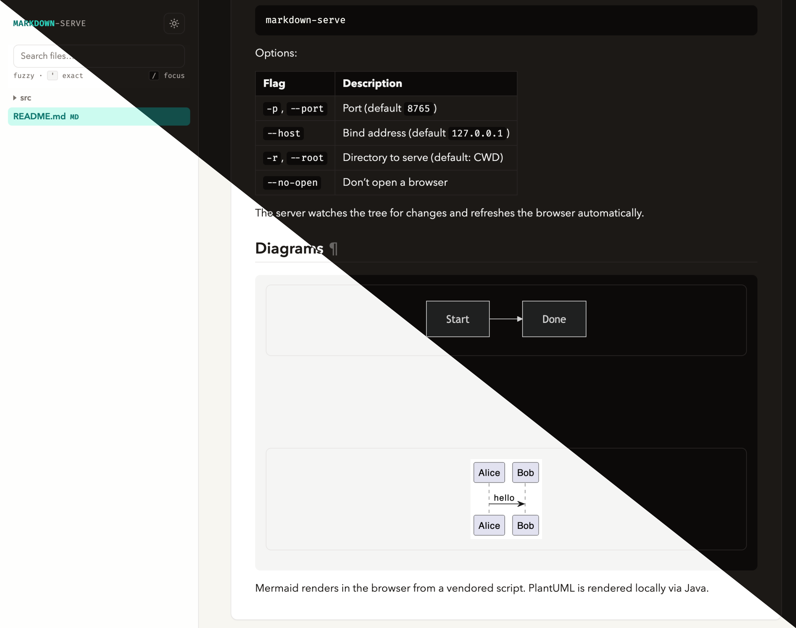
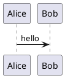

# markdown-serve

<p align="center">
  
</p>

**A local live Markdown viewer for the folder you’re working in.**

Point it at a notes tree, a docs repo, or any project with `.md` files. You get a file sidebar, instant preview, and automatic reload when you save — no cloud, no CDN, no plantuml.com.

<p align="center">
  
</p>

<p align="center"><em>Light and dark theme in one glance — same layout, same diagrams.</em></p>

## What you get

| | |
|---|---|
| **Browse the tree** | Collapsible left sidebar lists Markdown, diagram files, images, and PDFs. Fuzzy find with `/`, or prefix with `'` for exact match. |
| **Content search** | Switch to **Content** mode to full-text search all Markdown and diagram files (same fuzzy / `'exact` rules). Hits link to `?line=N` and scroll to that line. |
| **Table of contents** | Collapsible right sidebar lists headings on the open page (nested by level), with scroll spy. |
| **Broken links** | Local links to missing files show in orange with a ⚠ marker. |
| **Live preview** | Edits on disk refresh the browser over a WebSocket. Save and the page updates. |
| **Real rendering** | Nested lists (2-space indent), tables, syntax-highlighted code ([Pygments](https://pygments.org/)), images, linked assets, PDF iframe preview. |
| **Diagrams** | [`mermaid`](https://mermaid.js.org/) and [`plantuml`](https://plantuml.com/) / `puml` fences render in place — Mermaid in the browser, PlantUML via local Java. Standalone `.mmd` / `.puml` files open directly as a rendered diagram. |
| **CSV / TSV** | `.csv` / `.tsv` files open as a table with controls for delimiter, header lines to skip, and footer lines to skip. |
| **Themes** | Light/dark toggle (persisted). **Right-click the theme button** to show a Pygments style picker for the current theme (code highlighting) plus line-length / wrap settings for text and tables. |
| **Offline-first** | UI, Mermaid, and PlantUML jar ship with the project. Works on a plane. |

Wide tables and PlantUML SVGs expand the content panel instead of getting squashed; paragraphs keep wrapping at the configured line length.

## What you need

### Installed by uv

Python dependencies live in `pyproject.toml` and are installed with [uv](https://docs.astral.sh/uv/). The core viewer does not need the C++ extra.

```bash
git clone <this-repo>
cd markdown-serve
uv sync
export PATH="$PWD/bin:$PATH"
```

Code documentation for C++ also needs the optional extra (the `libclang` Python bindings and, in the wheel, a bundled `libclang.so`):

```bash
uv sync --extra cpp
```

### Not installed by uv

These are declared in `[tool.markdown-serve.system-requires]` in `pyproject.toml`. `uv sync` does not install them. They are required even when a machine or container already has them.

| Tool | Used for |
|------|----------|
| `java` | PlantUML. A JRE on `PATH`, or a `plantuml` binary. Already required by the viewer. |
| `clang++` | C++ code docs. Must be runnable at the compiler path recorded in `compile_commands.json`. Used for `-print-resource-dir` when that compiler exists. |
| `libclang` (`libclang.so`) | C++ code docs, when the bundled wheel library is not used. Search order: `codedoc.cpp.libclang` in `.markdown-serve.json`, `$LIBCLANG_PATH`, system (`llvm-config --libdir`, `/usr/local/lib/libclang.so`, `/usr/lib/llvm-*/lib`), then the wheel. |

`compile_commands.json` is project build output, not a package. CMake writes it with `-DCMAKE_EXPORT_COMPILE_COMMANDS=ON`.

## Quick start

From any directory that has Markdown:

```bash
markdown-serve
```

Opens `http://127.0.0.1:8765` and serves the current working directory.

| Flag | Description |
|------|-------------|
| `-p`, `--port` | Port (default `8765`) |
| `--host` | Bind address (default `127.0.0.1`) |
| `-r`, `--root` | Directory to serve (default: CWD) |
| `--no-open` | Don’t open a browser |

`serve` is the default subcommand, so `markdown-serve -p 9000` still starts the viewer. `markdown-serve serve` is the same thing.

## UI and search

### Sidebars

- **Files (left)** — Collapse with the chevron next to the theme toggle; a floating button restores it. Collapse state is stored in `config.json`.
- **On this page (right)** — Nested heading list for the current Markdown file. Collapse with its chevron; expands again from the floating control on the right. Collapse state is stored in `config.json`. Hidden when there are no headings, or when viewing an image/PDF.

### File and content search

Focus the finder with `/`. Use the **Files** / **Content** tabs (or `Tab` while the finder is focused) to switch modes.

| Mode | Behavior |
|------|----------|
| **Files** | Filters the sidebar tree by path/name. Default is fuzzy subsequence match; prefix the query with `'` for substring (exact) match. |
| **Content** | Server-side full-text search over all Markdown under the serve root. Same fuzzy / `'exact` syntax. Results show a snippet and line badge (`L42`); opening one navigates to `/path/to/file.md?line=42` and scrolls/highlights that line in the preview. |

Hints under the finder: `fuzzy · ' exact` · `/` focus · `tab` mode.

Arrow keys move focus in the result list; `Enter` opens the focused hit; `Escape` clears the query (or blurs the finder).

### Broken links

After a page loads, relative and same-origin links are checked against the filesystem. Targets that do not exist are colored orange and get a warning mark (⚠). External URLs, `mailto:`, and heading permalinks are left alone.

## Diagrams

Fenced blocks just work:

````markdown

```mermaid
flowchart LR
  A[Start] --> B[Done]
```


```plantuml
@startuml
Alice -> Bob: hello
@enduml
```
````

[Mermaid](https://mermaid.js.org/) uses the vendored browser script. [PlantUML](https://plantuml.com/) runs locally (`java -jar` on the bundled LGPL jar, or a `plantuml` binary on `PATH`).

Hover a diagram or image and click the enlarge button for a fullscreen zoom/pan view. For very large diagrams, the bitmap button (or `b`) rasterizes the SVG so panning and zooming stay fast; press it again to return to crisp vector rendering.

### Standalone diagram files

Diagram source files show up in the sidebar and open as a single rendered diagram, with the same live reload and theme handling as Markdown:

| Kind | Extensions |
|------|------------|
| Mermaid | `.mmd`, `.mermaid` |
| PlantUML | `.puml`, `.plantuml`, `.pu`, `.iuml`, `.wsd` |

PlantUML files without `@startuml` / `@enduml` are wrapped automatically. Content search covers these files too.

## Configuration

On first run, `src/markdown_serve/config.json` is created with defaults if it is missing.
It holds theme, [Pygments](https://pygments.org/) styles, font stacks, sidebar collapse state, and wrapping:

```json
{
  "theme": "light",
  "styles": { "light": "default", "dark": "nord" },
  "fonts": {
    "sans": ["Avenir Next", "Segoe UI", "system-ui", "sans-serif"],
    "mono": ["Fira Code", "ui-monospace", "monospace"]
  },
  "sidebars": {
    "files_collapsed": false,
    "toc_collapsed": false
  },
  "text": { "wrap": true, "width": 90 },
  "tables": { "wrap": true, "width": 80 }
}
```

Left-click the sun/moon button to toggle light and dark. **Right-click it** to reveal the settings panel: the code-highlighting style dropdown for the active theme (any installed Pygments style), and wrap / line-length controls for text and tables. `width` is in characters (`ch`, 20–300). With `text.wrap` off, paragraphs fill the whole panel (including when it is widened for a table); with `tables.wrap` off, cells never wrap and the panel grows to fit. Collapsing either sidebar updates `sidebars` in this file. Fonts are config-only (no picker). The file is gitignored so local preferences stay on your machine.

## Code documentation cache

Optional. The viewer runs without it. When the tools above are present, markdown-serve can build a cache of generated markdown for C++ sources, in the style of `go doc`: one page per source file, with the file comment, an index, signatures, and the comment above each declaration. A documented function or type named in a signature is a link to its definition, and the definition lists the signatures that mention it. Headings and index entries carry a badge for the symbol kind (namespace, class, struct, enum, function, field, macro, include guard, and so on). Doxygen commands (`@brief`, `@param`, `@return`, `@tparam`, `@note`, `@see`, `@code`) are rendered as markdown. A `//` or `/* */` comment sitting directly above a declaration is used when there is no doxygen comment.

The cache is written to `<project>/.cache/markdown-serve/` (override with `codedoc.cache_dir`). Add `.cache/` to the project's `.gitignore`. Pages are viewed at the source path (`/libs/foo.hpp`), not under `.cache`, so relative links in the generated markdown are written from the source file's directory. The language index lives in the cache (`/.cache/markdown-serve/cpp/index.md`); its links use `../` to climb back out to the project tree.

A project can use more than one language later. Only C++ is implemented. The registry in `src/markdown_serve/codedoc/registry.py` is where another backend (for example `go doc`) would be added.

### Project config

Optional file: `<project>/.markdown-serve.json`. Paths matching `ignore` are left out of the cache. Globs: `*` is one path segment, `**` is any depth. Prefix `re:` for a regular expression.

For a tree like reda-engine, ignore vendored code and CMake build directories:

```json
{
  "ignore": ["third-party/**", "cmake-build-*/**"],
  "codedoc": {
    "cache_dir": ".cache/markdown-serve",
    "languages": ["cpp"],
    "jobs": null,
    "cpp": { "compile_commands": "compile_commands.json", "libclang": null }
  }
}
```

Those two ignore patterns are the default when the file is missing. `jobs` null uses one process per CPU. `libclang` null uses the search order above.

### Build

```bash
markdown-serve build-cache --check          # tool status, no parse
markdown-serve build-cache                  # incremental
markdown-serve build-cache --force          # reparse everything
markdown-serve build-cache --clean          # delete the cache first
markdown-serve build-cache -j 4 --lang cpp  # one language, 4 workers
markdown-serve build-cache -r /path/to/project
```

In the viewer, **Code docs** in the toolbar shows each requirement (green when present, red with the install hint when missing), the last build, **Build** (full), **Update** (incremental), **Cancel**, and a progress bar. **Show documented source files in sidebar** adds the documented `.hpp` / `.cpp` files to the file tree. It is off by default. A markdown link to a source file opens the generated page either way; without a cache, the page shows the highlighted source and tells you to build.

## Development

```bash
uv sync --group dev
uv run playwright install chromium
uv run pytest
```

Browser tests live in `tests/e2e`. They start the viewer against `tests/e2e/workspace` and include a screenshot test that writes `readme_files/combined.png` (light and dark, split diagonally):

```bash
uv run pytest tests/e2e
```

## Third-party / offline assets

Vendored under `src/markdown_serve/assets/vendor/`:

- **[Mermaid](https://mermaid.js.org/)** (MIT) — `mermaid.min.js`
- **[PlantUML](https://plantuml.com/)** (LGPL jar, unmodified) — `plantuml.jar`

Code blocks are highlighted with **[Pygments](https://pygments.org/)** (Python dependency, not vendored as a static asset).

markdown-serve uses PlantUML, which is distributed under the LGPL. Details: `src/markdown_serve/assets/vendor/README.md`.
