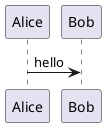

# markdown-serve

A local live Markdown viewer for the folder you’re working in.

## Options

| Flag | Description |
|------|-------------|
| `-p`, `--port` | Port (default `8765`) |
| `--host` | Bind address (default `127.0.0.1`) |
| `-r`, `--root` | Directory to serve (default: CWD) |
| `--no-open` | Don’t open a browser |

The server watches the tree for changes and refreshes the browser automatically.

## Diagrams

Mermaid renders in the browser from a vendored script. PlantUML is rendered locally via Java.
