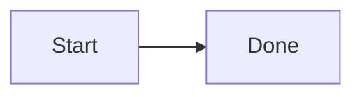
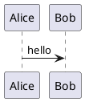

# markdown-serve

A local live Markdown viewer for the folder you’re working in.

## Options

| Flag | Description |
|------|-------------|
| `-p`, `--port` | Port (default `8765`) |
| `--host` | Bind address (default `127.0.0.1`) |
| `-r`, `--root` | Directory to serve (default: CWD) |
| `--no-open` | Don’t open a browser |

The server watches the tree for changes and refreshes the browser automatically.

## Diagrams


```mermaid
flowchart LR
  A[Start] --> B[Done]
```


```plantuml
@startuml
Alice -> Bob: hello
@enduml
```

```excalidraw
{
  "type": "excalidraw",
  "version": 2,
  "elements": [
    {
      "id": "r1",
      "type": "rectangle",
      "x": 10,
      "y": 10,
      "width": 120,
      "height": 48,
      "strokeColor": "#1e1e1e",
      "backgroundColor": "#a5d8ff",
      "fillStyle": "solid"
    },
    {
      "id": "t1",
      "type": "text",
      "x": 28,
      "y": 22,
      "width": 84,
      "height": 24,
      "text": "Sketch",
      "fontSize": 20,
      "fontFamily": 1
    }
  ]
}
```

Mermaid renders in the browser from a vendored script. PlantUML is rendered locally via Java. Excalidraw is rendered locally to SVG.
